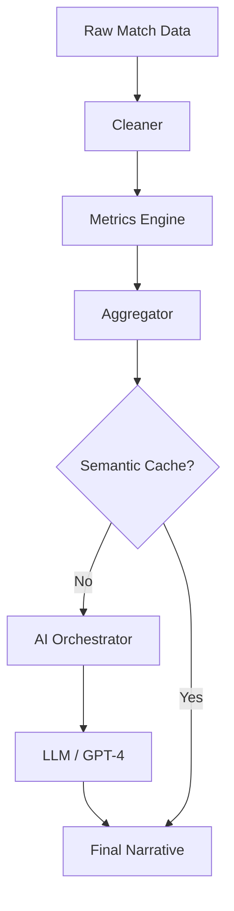

# 📂 Engine de Análise (Elite AI Pipeline)

> **Objetivo**: Transformar dados brutos de partidas em narrativas, métricas e planos de treino via IA.

## 🔗 Mapeamento Técnico
-   **AnalysisService.js**: Orquestrador central do pipeline.
-   **Cleaner.js**: Primeiro estágio. Sanitiza e garante integridade dos dados brutos.
-   **Metrics.js**: Segundo estágio. Cálculos determinísticos (WR, Pontos, Médias).
-   **Aggregator.js**: Terceiro estágio. Classificação de Cenários e Flags (Stamina, Agressividade).
-   **AIOrchestrator.js**: Quarto estágio. Integração com LLM via Prompt Registry.

## 🧬 Linhagem e Fluxo

## ⚙️ Dependências e Impacto
-   **Depende de**: `AnalysisService`, openai, e diretório `backend/src/prompts/`.
-   **Impacto**: Vital para a retenção de usuários. Falhas resultam em análises genéricas ou erros de dashboard.
