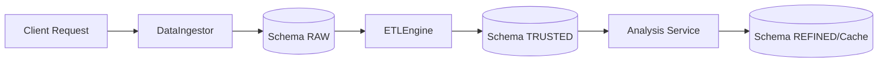

# 📂 Camada de Dados (Medallion Platform)

> **Objetivo**: Gerenciar o ciclo de vida dos dados, desde a ingestão bruta até o refinamento para análise.

## 🔗 Mapeamento Técnico
-   **DataIngestor.js**: Única porta de entrada de dados. Enforça o RAW-First.
-   **ETLEngine.js**: Processa dados do `raw` para o `trusted`, aplicando validações.

## 🧬 Linhagem e Fluxo

## ⚙️ Dependências e Impacto
-   **Depende de**: `config/db.js`, `config/setup.js`.
-   **Impacto**: Core do sistema. Qualquer falha aqui interrompe a gravação de todas as funcionalidades.
