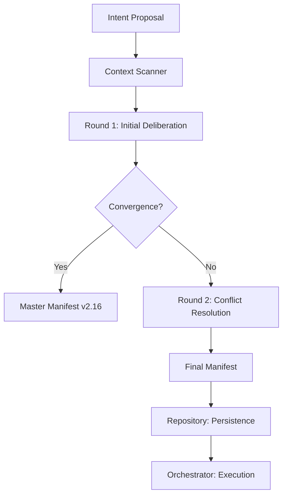

# BOLT — Camada de Deliberação (Arquitetura Industrial v2.16)

## Objetivo

Definir de forma clara e determinística como funciona a **camada de deliberação** no protocolo BOLT Platinum. O sistema evoluiu de uma proposta conceitual para um motor de governança industrial, unindo transparência radical e segurança de hardware.

---

# 🧩 Princípios de Elite

> **Deliberação não é discussão aberta.** É um processo orquestrado de convergência técnica e estratégica.
> **Confiança Ponderada:** Decisões baseadas em métricas, não apenas em consenso.
> **Zero Silent Degradation:** Falhas são categorizadas e escaladas (Gold Shield).

---

# 🧱 Estrutura da Orquestração (Update v2.16)

O fluxo agora é gerenciado pelo **Deliberation Controller (O Maestro)** em rodadas determinísticas:

---

# 🧠 Papéis dos Agentes (The Triumvirate)

A governança é exercida por três agentes com pesos específicos na Matriz de Confiança:

### 1. 🔍 Context Scanner (Constraint Engine) - Peso 0.4
- **Responsabilidade**: Auditoria de Realidade. É o único agente que "lê" o legado do Backend e Frontend.
- **Discovery Obrigatório**: Varre o código, mapeia endpoints, services e componentes reais.
- **Veredito**: Define `Ready: True/False` e gera alertas `HARD/SOFT` (Severidade Low/Med/High).
- **Regra**: *"Nenhuma feature é projetada sem passar pela auditoria do Scanner."*

### 2. 📐 Architect (Solution Designer) - Peso 0.3
- **Responsabilidade**: Autoridade técnica final. Decide a abordagem e resolve impasses do Scanner.
- **Expertise**: Define o `impact_scope` (Arquivos/Serviços) e o `diff_awareness` (Change Type/Size).
- **Projeção**: Gera o `execution_plan` (Passos priorizados) e o `rollback_plan` (Saga Pattern).

### 3. 📝 PO (Value Guardian) - Peso 0.3
- **Responsabilidade**: Guardião da intenção e do valor de negócio.
- **Validação**: Garante que a solução técnica não desvia do escopo funcional.
- **Poderes**: Veto estratégico. Ajusta requisitos com base no feedback do Architect.

---

# 💾 Camada de Suporte & Persistência

### 🗄️ Governance Repository (Memória Industrial)
- **Manifests**: Persiste planos `v2.16` em `bolt_manifests` (JSONB + GIN Indexes).
- **Executions**: Gerencia o estado de runtime em `bolt_executions` (Heartbeat + Logs).
- **Audit**: Garante versionamento e queryabilidade de cada decisão técnica.

### 🛰️ Orchestrator Executor (As Mãos)
- **Resiliência**: Opera sob **Saga Pattern** com compensação por step.
- **Segurança**: Aplica `Strict Enforcement` e respeita `Execution Guardrails`.
- **Inteligência**: Retry progressivo, lock distribuído e checkpointing formal.

---

# ⚙️ Modos de Operação (Fora do Loop de Decisão)

O Backend e o Frontend não votam nem decidem. Eles operam em dois estados controlados pela governança:

| Componente | Modo de Dados (Input para o Scanner) | Modo Executor (Output do Manifesto) |
| :--- | :--- | :--- |
| **Backend** | Código-fonte auditado pelo Scanner para detecção de reuso. | Implementa o contrato final; gera código/diff. |
| **Frontend** | Estrutura de UI auditada pelo Scanner para consistência visual. | Implementa a interface baseada no contrato final. |

---

# 🚥 Semântica de Status (Matrix Decision)

| Status | Ação | Destino |
| :--- | :--- | :--- |
| **CONVERGED** | Sucesso Total (Confiança > 0.8). | Execução Automática. |
| **DEGRADED** | Trade-offs detectados (Fails Med/High). | Aprovação Manual Requerida. |
| **BLOCKED** | Impasse técnico após Round 2. | Revisão de Engenharia. |
| **ESCALATED** | Falha de Validator ou Crise Sistêmica. | Intervenção de Gestão. |

---

# ⚠️ Regras Críticas de Governança

1. **Separação de Modos**: Consultor pensa/planeja; Executor opera/codifica.
2. **Gold Shield**: Falhas recursivas de validação escalam para `ESCALATED`.
3. **Execution Plan Prioritário**: Infraestrutura → Backend → Frontend.
4. **Strict Enforcement**: Bloqueio físico de escrita em caminhos restritos (Backend-only, etc).

---

# ❌ Anti-Patterns (O que evitamos)
- Múltiplos agentes debatendo sem orquestrador.
- Loops infinitos de refinamento (Limitamos a 2 Rounds).
- Consultor executando código em área de produção.
- Executor tomando decisão de escopo.

---

# 🚀 Benefícios Industriais
- **Eliminação de Duplicação**: Discovery obrigatório mata o código redundante.
- **Rastrabilidade Total**: Cada step da execução é logado estruturadamente.
- **Segurança Transacional**: Rollback explícito via Saga Pattern.
- **Previsibilidade**: O sistema sabe o risco e impacto **antes** de começar.

---

# 🏁 Conclusão

BOLT organiza a inteligência coletiva através de **quem pensa, quem decide e quem executa**. Garantindo que nada ambíguo chegue na execução, transformamos a codificação AI em engenharia de precisão.
