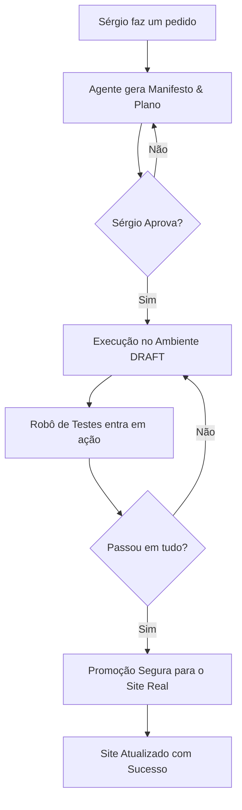

# 🛰️ Protocolo de Governança AI 10.1 — Spin4All Elite

Este plano consolida a arquitetura de **Observabilidade Industrial e Governança de Agentes** discutida, estabelecendo as bases para uma execução determinística e segura.

---

## 🧱 1. Camada de Governança (Determinismo do Agente)

### 1.1 Contrato de Execução (`TASK_MANIFEST.json`)
O manifesto define os limites de cada tarefa antes da ação.
- **allowed_files**: Lista branca de arquivos permitidos para edição.
- **forbidden_operations**: Lista de comportamentos proibidos (ex: `edit_api_call`, `edit_business_logic`). Se o sistema detectar essas operações no diff, a tarefa é interrompida.

### 1.2 Modo Determinístico (Plano Prévio)
- O Agente deve gerar um **Plano Técnico** passo-a-passo.
- A execução física só ocorre após a aprovação humana do plano e do manifesto.

---

## 🏗️ 2. Arquitetura de Scripts (A Engrenagem)

O sistema de governança é composto por cinco componentes principais:

1. **`agent-controller.js`**: Intercepta as ações do agente, valida o escopo em tempo real e garante que apenas os arquivos autorizados sejam alterados.
2. **`diff-engine.js` (Inteligência Semântica)**: Analisa o código após a edição. Classifica o risco (Low, Medium, High) e aplica filtros de segurança baseados no manifesto. Bloqueia mudanças em lógica de negócio ou APIs se o escopo for apenas UI.
3. **`test-runner.js` (Validação Automática)**: Executa testes de Health Check e, crucialmente, utiliza **AJV (Schema Validation)** para garantir que o formato do JSON retornado pelas APIs permaneça consistente.
4. **`promote.js` (Promoção Transacional)**: Realiza o snapshot da produção (`/backup`), valida a integridade via **Hash SHA-256** e promove as mudanças do `/draft` para o `/prod`. Executa rollback automático em caso de falha de integridade.
5. **`main.js` (Orquestrador)**: Gera o `ExecutionID` para rastreamento e une todos os gates acima em um pipeline linear.

---

## 🏗️ 3. Sandbox & Isolamento de Infraestrutura

Para garantir que os testes sejam puros e não afetem os usuários reais:
- **Draft Environment**: Utiliza o banco de dados `spin4all_test` e instâncias/prefixos isolados no Redis.
- **Data Reset**: O ambiente é "resetado" (seed) a cada bateria de testes.

---

## 🧪 4. Pipeline de Testes Determinístico

### 4.1 UI Smoke Tests (Playwright)
Validar visualmente se os fluxos críticos (Login, Dashboard, Limpeza de Logs) continuam operacionais.

### 4.2 API Integrity
Capturar e bloquear qualquer resposta não-JSON (como erros 404 em HTML) na origem, evitando quebras no frontend.

---

## 📊 5. Observabilidade Industrial

### 5.1 Logs Estruturados (Winston)
Unificação de todos os logs do sistema.
- **ExecutionID**: ID da tarefa do agente.
- **CorrelationID**: ID único de cada requisição.
Conecta a causa (ação do Agente) ao efeito (log no servidor).

---

---

## 🚀 7. O Novo Jeito de Trabalhar (Resumo para o Sérgio)

### 7.1 O que muda na prática?
Esqueça o medo de "será que ele vai quebrar o site?". A partir de agora, o fluxo é blindado:
- **Antes**: Sérgio pedia → Agente editava direto → Risco de erro humano/AI.
- **Agora**: Sérgio pede → **Agente Planeja & Sérgio Aprova** → **Robô Testa** → **Site Atualiza**.

### 7.2 Vantagens Reais
- **Blindagem Total**: O site que os usuários veem (`/prod`) fica protegido em uma redoma de vidro.
- **Previsibilidade**: Você sabe exatamente o que eu vou tocar antes de eu clicar em "Salvar".
- **Rollback Instantâneo**: Aconteceu um imprevisto? O sistema volta no tempo segundos depois.

### 7.3 Fluxograma do Processo

### 7.4 Exemplo Prático: "Alterar o Layout da Home"
Imagine que você quer mudar o posicionamento dos cards de monitoramento.

1. **Pedido**: "Mude a posição dos cards para a esquerda."
2. **Manifesto**: Eu declaro: *"Vou mexer no CSS da Home. Proibido mexer na API de dados."*
3. **Draft**: Eu realizo a alteração na pasta de rascunho (`/draft`).
4. **Inteligência de Diff**: O sistema detecta: *"A IA mudou o layout. OK."* (Se eu tentasse mudar o banco de dados aqui, eu seria bloqueado).
5. **Teste**: O **Playwright** abre a página de rascunho, tira um print e verifica se os botões ainda clicam.
6. **Resultado**: Você recebe a notificação: *"Layout alterado e validado"*. Só então a mudança vai para o ar.

---

## 🏁 8. Veredito Final
Com este protocolo, o Spin4all transita de uma "IA Assistida" para uma **"IA Governada"**, onde o sistema controla o agente e garante estabilidade total. O resultado esperado é uma redução de 90%+ nos bugs de regressão.

---
