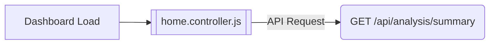
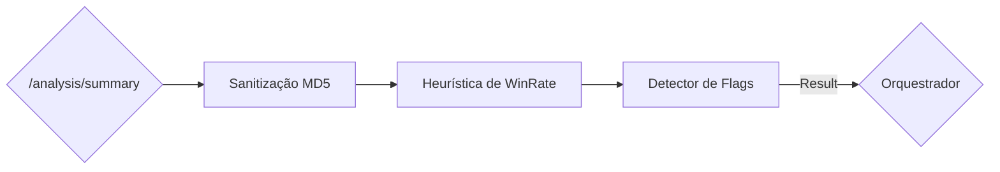
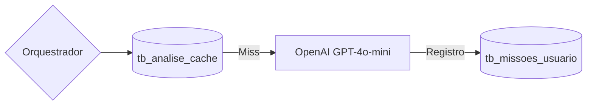
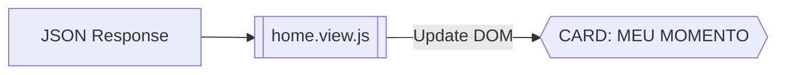

# Fluxograma Detalhado: Motor do Analista (Spin4All)

Como o fluxo completo é denso, quebrei a "esteira" em 4 estágios críticos para facilitar sua validação. Navegue pelo carrossel abaixo:

````carousel
### 🔵 Estágio 1: Gatilho e Requisição (Frontend)

O processo começa assim que o Dashboard é carregado. O controller é o "gatilho" que acorda o motor.



**Pontos de Auditoria:**
- **Trigger**: O `init()` do controller dispara a chamada sem depender de clique, garantindo que o dado esteja pronto rápido.
- **Segurança**: A requisição leva o **JWT Token** (autenticação) para saber quem é o usuário.

<!-- slide -->

### 🟣 Estágio 2: Motor de Heurísticas (Backend)

Aqui é onde a "mágica" técnica acontece. O backend processa os números frios.



**Pontos de Auditoria:**
- **Sanitização**: Filtra jogos com duração errada ou scores impossíveis.
- **Detecção de Flags**: Calcula se você é **STAMINA** (cança no final) ou **AGRESSIVO** (ritmo alto). 
- **Decisão**: O Orquestrador escolhe 1 entre os 6 cenários técnicos disponíveis.

<!-- slide -->

### ⚫ Estágio 3: Inteligência e Persistência (DB & IA)

O motor decide se usa o cache ou se gera um novo insight com IA.



**Pontos de Auditoria:**
- **Performance**: O `tb_analise_cache` evita chamadas de IA desnecessárias se seus dados não mudaram.
- **Side Effect Real**: O motor injeta 2 novas metas no `tb_missoes_usuario` com a tag técnica detectada. **Este é o ponto onde o analista te dá tarefa de casa.**

<!-- slide -->

### 🟢 Estágio 4: Output e Renderização (Frontend View)

O retorno da API é "desenhado" na tela para você.



**Pontos de Auditoria:**
- **Visual**: O `home.view.js` limpa o card e injeta a nova narrativa, confiança e botões de ação.
- **Feedback**: Se não houver dados de torneio, o motor cai no **Fallback de Diagnóstico** e mostra dicas baseadas no seu perfil inicial.
````

---

## 🔍 Resumo para Validação Rápida

| Estágio | Arquivo/Ponto Crítico | Objetivo |
| :--- | :--- | :--- |
| **Gatilho** | [home.controller.js](file:///c:/Users/sjwse/OneDrive/Documentos/Antigravity/spin4all/frontend/js/modules/home/home.controller.js) | Iniciar a pipe assim que o portal abre. |
| **Lógica** | [server.js](file:///c:/Users/sjwse/OneDrive/Documentos/Antigravity/spin4all/backend/server.js) (Fase 1 e 2) | Transformar scores de partidas em Flags (Stamina, etc). |
| **Escrita** | `tb_missoes_usuario` | Gravar os treinos recomendados como metas reais. |
| **Exibição** | [home.view.js](file:///c:/Users/sjwse/OneDrive/Documentos/Antigravity/spin4all/frontend/js/modules/home/home.view.js) | Mostrar o texto final e o badge de confiança. |
